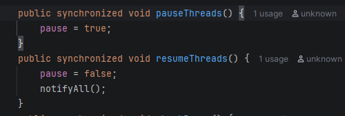
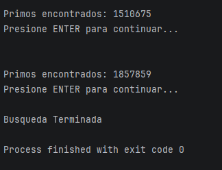
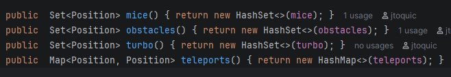
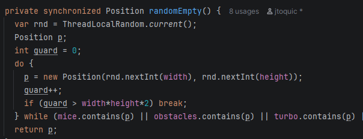
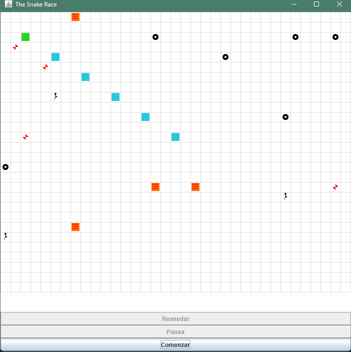
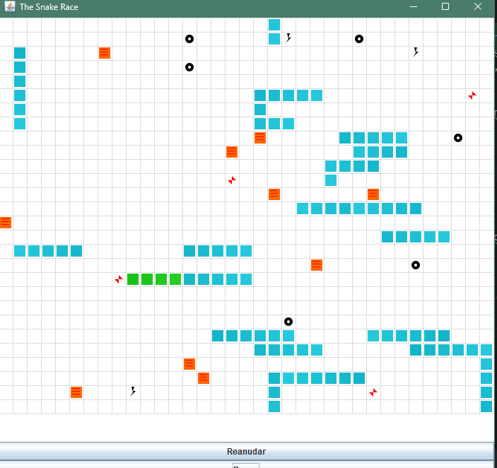

# Snake Race — ARSW Lab # 1 - Juan Esteban Rodríguez 
---

# Introducción

En este laboratorio se llevará a cabo la modificación de dos aplicaciones: un juego de la serpiente y un contador de números primos. El objetivo principal de esta actividad es integrar conceptos fundamentales relacionados con la programación concurrente y los mecanismos de sincronización. A medida que las aplicaciones interactivas incrementan en complejidad, resulta indispensable implementar la ejecución simultánea de múltiples tareas, lo que permite que diversos componentes del sistema operen de manera independiente y eficiente

---

## Arquitectura (carpetas)

```
firstpart (Primera parte del laboratorio)
├─ Control.java             # Bootstrap de la aplicación (Main)
├─ Main.java                # Motor de Hilos
├─ PrimerFinderThread       # Objeto 

co.eci.snake (Segunda parte del laboratorio)
├─ app/                 # Bootstrap de la aplicación (Main)
├─ core/                # Dominio: Board, Snake, Direction, Position
├─ core/engine/         # GameClock (ticks, Pausa/Reanudar)
├─ concurrency/         # SnakeRunner (lógica por serpiente con virtual threads)
└─ ui/legacy/           # UI estilo legado (Swing) con grilla y botón ActionQ1
```
---

## Reporte de Laboratorio

### Parte 1 (Calentamiento)

En el laboratorio se utilizaron estrategias como **wait**, **notify** y **synchronized**, que facilitan que los hilos puedan pausarse individualmente mientras generan un resultado en el contexto del problema a resolver. En este caso, el objetivo consistía en calcular la cantidad de números primos. Si deseábamos reanudar la búsqueda, se aplicaba un **notifyAll** para continuar con la ejecución.

A continuación, se anexa cada evidencia de lo implementado 

- La primera parte era implementar una pausa a todos los hilos trabajadores, se hizo a partir de una variable compartida (pause) y con los mecanismos de 
sincronización **wait()** y **notifyAll()**. Esto permite detener temporalmente todos los threads.
- Para reanudarlos se uso un ENTER por medio de Scanner, nos ayuda con la detencion a la espera de que el usuario haga una ejecución.




- El objeto **Control** se conoce como el lock mediante mecanismos de **synchronized**, garantizando exclusión mututa en el acceso al variable recien asiganda de Pausar los hilos (pause).
- Evitamos los lost wakeups usando ciclos alrededor de **wait()**. Cuando un hilo dispara, vuelve a chequear la condición antes qhe continuar.
- El método de Pausa es volatil ya que se asegura de que todos los hilos observen los cambios realizados por el controlador.

---

## Parte 2 SnakeRace concurrente

### Analisis de concurrencia

#### Uso de hilos
- En este ejercicio de Snakes se utilizan hilos virtuales, una funcionalidad introducida a partir de Java 21. Su principal beneficio radica en la disminución del consumo de recursos en comparación con los hilos tradicionales, que generalmente demandan una cantidad significativa de memoria por cada instancia. Los hilos virtuales delegan la administración de estos recursos a la JVM, la cual optimiza su distribución y facilita la creación de una cantidad considerable de hilos de forma eficiente.

#### Condiciones de Carrera
- Como posibles condiciones de carrera, una de ellas es cuando serpiente consume un ratón, ya que este evento desencadena la creación de un nuevo ratón y un nuevo obstáculo.
- En la creación de portales, se identifica una situación de riesgo relacionada con el uso del método **randomEmpty()** para asignar ubicaciones. Dicho método carece de mecanismos de sincronización, lo que permite que múltiples hilos lo ejecuten de manera simultánea. Esta concurrencia puede generar resultados inconsistentes y ocasionar conflictos al asignar las posiciones en el tablero.

#### Colecciones o estructuras no seguras
- Si usamos de manera exagerada el mecanismo **synchronized**, afecta el rendimiento del hilo principal cuyo es el encargado de tener acceso a las colecciones desde la UI.

#### Ocurrencias de espera activa (busy-wait)
- No es necesario usar la palabra **synchronized**, ya que la llamada se realiza desde el hilo principal y no será accedida por otros hilos durante el transcurso de la partida. Esto implica que estamos retrasando la obtención de estas colecciones al intentar sincronizarlas innecesariamente.

### Correcciones minimas 

Una situación crítica que se presentó fue el prolongamiento del proceso para crear distintos objetos que la serpiente pudiera encontrar, y todo esto debido al uso del mecanismo **synchronized**. Para solucionar el problema, se eliminó dicha palabra  de los métodos **mice()**, **obstacles()**, **turbo()** y **teleports()**, optimizando así su funcionamiento.


Otra situaciòn que se evidencio fue que se añadio **synchronized** en randomEmpty para evitar problemas de carrera


#### Control de ejecucion (UI)

Para esta parte de UX, se me asigno implementar botones de Pausa, Inicio y Comienzo. Aplique un **BorderLayout** junto con su logica, implementando tambien algunos mecanismos de sincronizaciòn


Boton de Inicio(start): Boton para empezar el juego, despues de un click no se puede volver a iniciar
Boton de Pausa(pause): Boton que detiene el juego y mantiene el estado actual del juego
Boton de Reanudar(resume): Boton que despues de darle pause, se da resume y retoma el juego con el estado que estaba anteriormente


Adicional se muestra un caso en el que al dar **Pause**, arroja el la serpiente con mayor tamaño


#### Robustez
Se aplica un N alto de 20 serpientes para verificar si hay rompimiento, en este caso no se presentan por la fluidez y mantenibilidad de la carrera

---
## Créditos

Este laboratorio es una adaptación modernizada del ejercicio **SnakeRace** de ARSW. El enunciado de actividades se conserva para mantener los objetivos pedagógicos del curso.

**Base construida por el Ing. Javier Toquica.**

**Modificado por Juan Esteban Rodriguez.**


